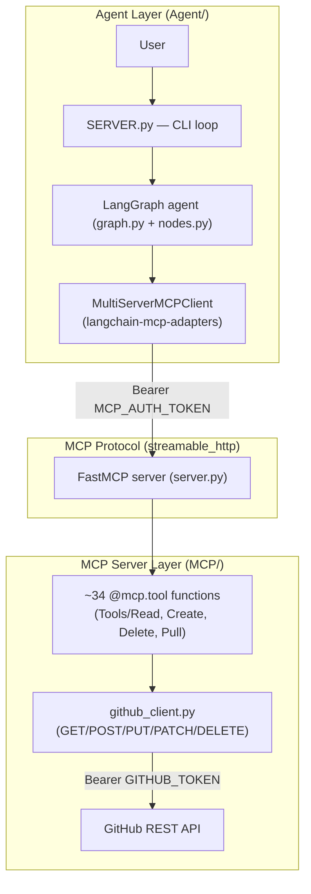
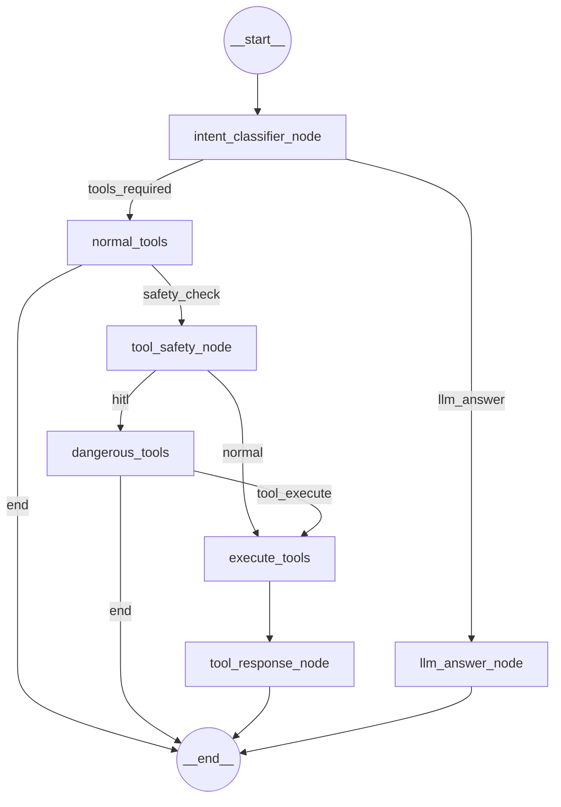

# ForgeMCP

**An MCP-native GitHub automation platform with a LangGraph-powered conversational agent, human-in-the-loop approval for destructive actions, and a full FastMCP tool server exposing the GitHub REST API.**

---

## Table of Contents

- [Project Overview](#project-overview)
- [Features](#features)
- [Architecture](#architecture)
- [Workflow](#workflow)
- [Folder Structure](#folder-structure)
- [Technologies Used](#technologies-used)
- [Available Tools](#available-tools)
- [Prompt System](#prompt-system)
- [LangGraph Nodes](#langgraph-nodes)
- [Human In The Loop](#human-in-the-loop)
- [Advantages](#advantages)
- [Limitations / Current Flaws](#limitations--current-flaws)
- [Suggested Improvements](#suggested-improvements)
- [Use Cases](#use-cases)
- [Installation](#installation)
- [Quick Start](#quick-start)
- [Example Commands](#example-commands)
- [Future Roadmap](#future-roadmap)
- [API / MCP Tools](#api--mcp-tools)
- [Project Review](#project-review)
- [Conclusion](#conclusion)

---

## Project Overview

**ForgeMCP** is a two-layer system that lets a language model operate GitHub on a user's behalf through natural language, with a safety gate in front of anything destructive.

It is built from two cooperating parts:

1. **An MCP (Model Context Protocol) server** (`MCP/`) — a [FastMCP](https://github.com/jlowin/fastmcp)-based server that wraps the GitHub REST API as ~34 individually-typed, individually-documented tools (list repos, get a README, create a branch, merge a PR, delete a repository, etc.), authenticated with a bearer token and deployable as a standalone HTTP service (currently on Railway).
2. **A LangGraph agent** (`Agent/`) — a conversational agent built on [LangGraph](https://github.com/langchain-ai/langgraph) that connects to the MCP server as a tool client (via `langchain-mcp-adapters`' `MultiServerMCPClient`), classifies user intent, selects a tool, classifies the *safety* of that tool call, pauses for human approval when the action is destructive, executes the tool, and turns the raw tool output back into a natural-language answer.

**Why it exists:** talking to GitHub today means either using the `gh` CLI, clicking through the web UI, or hand-writing REST calls. ForgeMCP's goal is to make GitHub operable conversationally — "create a branch called `feature/auth` from `main`" — while keeping a human explicitly in the loop before anything irreversible happens (deleting a repo, merging a PR, deleting a file). The MCP layer is also decoupled from the agent: because it is a standard MCP server, any MCP-compatible client (Claude Desktop, another LangGraph app, a different LLM entirely) can drive the same GitHub tools without touching the agent code at all.

**Problems it solves:**
- Wrapping the (large, inconsistent) GitHub REST API behind a small, uniform, typed tool interface.
- Giving an LLM agent access to that interface without also giving it unsupervised write/delete power.
- Separating "can this model call GitHub" (MCP server + bearer auth) from "should this specific action run right now" (LangGraph safety classifier + interrupt-based approval).

---

## Features

- **~34 GitHub tools** spanning repository reads, commits, releases, branches, forks, contributors, file/repo creation, file/repo deletion, and the full pull-request lifecycle (create, list, get, update, merge, review, request reviewers).
- **Conversational intent routing** — the agent first decides whether a message needs a GitHub action at all, or is just a question it can answer directly (e.g. "what is a pull request?").
- **LLM-driven tool selection** — GitHub tools are bound directly to the chat model, which picks the tool and extracts its arguments from the user's message in a single call.
- **Independent safety classification** — before any selected tool runs, a *second*, dedicated LLM call classifies it as read-only ("safe") or state-changing ("hitl"), based on the tool's name, description, and the user's question.
- **Human-in-the-loop approval** — destructive tool calls pause the graph with LangGraph's `interrupt()` and wait for an explicit `y/n` before continuing, so nothing is deleted, merged, or overwritten without confirmation.
- **Bearer-token-authenticated MCP server** — the MCP server uses FastMCP's `StaticTokenVerifier` so it can be safely exposed over the network (e.g. on Railway) rather than only run locally over stdio.
- **Guarded network binding** — the server entrypoint (`demo.py`) refuses to bind to a non-loopback host unless an `MCP_AUTH_TOKEN` is set, to stop an accidentally-public, unauthenticated GitHub-mutating server.
- **Local-repo tools alongside API tools** — `clone_repository` and `push_local_to_github` shell out to `git` directly, so the agent can also work with a local working copy, not just the GitHub API surface.
- **Streaming responses** — the "no tool needed" answer path streams tokens from the LLM.
- **Thread-based conversation state** — LangGraph's checkpointer keys state by `thread_id`, so multi-turn conversations (including resuming after a HITL prompt) are tracked per session.

---

## Architecture

ForgeMCP is deliberately split into two independently runnable pieces that only communicate over MCP:



### Key architectural components

**MCP server (`MCP/`)**
- `server.py` defines a single shared `FastMCP("ForgeMCP")` instance, optionally wrapped with `StaticTokenVerifier` auth if `MCP_AUTH_TOKEN` is set.
- Every tool module imports that same `mcp` instance and registers itself with `@mcp.tool`, so all ~34 tools attach to one server regardless of which subpackage they live in.
- `config.py` loads `GITHUB_TOKEN` and `MCP_AUTH_TOKEN` from `.env` and builds the base GitHub `HEADERS` dict.
- `github_client.py` is the single HTTP boundary: `github_get`, `github_post`, `github_put`, `github_patch`, `git_delete`. Every write/delete call routes through `_auth_headers()`, which raises immediately if `GITHUB_TOKEN` is missing, so a misconfigured deployment fails fast rather than sending unauthenticated write requests.
- `helper.py` provides `get_authenticated_username()`, used by nearly every tool as the default `username` when the caller doesn't supply one (i.e. "act on my own account").
- `Tools/` is organized by intent — `Read/`, `create/`, `Delete/`, `Pull/` — each with an `__init__.py` that re-exports every tool in that category, and a top-level `Tools/__init__.py` that re-exports all four categories, so `demo.py` can register the whole tool surface with one `from MCP.Tools import *`.

**LangGraph agent (`Agent/`)**
- `state.py` defines the graph's shared state as a Pydantic model (`State`), plus two structured-output schemas used by the LLM: `RouterDecision` (tool vs. llm) and `ToolSafetyDecision` (hitl vs. safe).
- `nodes.py` implements every node function plus the routing functions used on conditional edges. Tools are injected at runtime via `set_tools()` once `MultiServerMCPClient.get_tools()` resolves — the module keeps `tools` and `llm_with_tools` as module-level state populated after startup.
- `graph.py` wires the `StateGraph`, compiles it with `InMemorySaver` as the checkpointer, and implements `run_graph()`, which loops on `__interrupt__` in the result to drive the HITL approval prompt.
- `service.py` builds the Mistral chat model (`ChatMistralAI`, `mistral-small-latest`, streaming) and the MCP server connection dict consumed by `MultiServerMCPClient` (currently pointed at a Railway deployment over `streamable_http` with a bearer token).
- `SERVER.py` is the CLI entrypoint: it builds the MCP client, loads tools, injects them into `nodes`, compiles the graph, and runs a `while True` input loop, resolving HITL interrupts via `input()`.
- `Prompts/` holds one file per prompt, each a `ChatPromptTemplate` — kept separate from the node logic so prompt text can be iterated on independently of graph wiring.

**State management** — the whole conversation turn (question, routing decision, selected tool, tool arguments, safety decision, approval flag, tool result, final answer) lives in one Pydantic `State` object that flows through every node and is checkpointed by thread. Currently this uses `InMemorySaver`, which is **not durable across process restarts** — a `PostgresSaver` migration is a planned/pending change (see [Limitations](#limitations--current-flaws)).

---

## Workflow

### Request lifecycle

A user message goes through up to six decision points before a final answer is produced:

```
User message
   │
   ▼
intent_classifier_node   — "does this need a tool, or is it a question?"
   │
   ├── llm_answer ──────────────────────────────► llm_answer_node ──► END
   │
   └── tools_required
        │
        ▼
      normal_tools        — LLM picks a tool + extracts its arguments
        │
        ├── end (no tool call produced) ─────────► END
        │
        └── safety_check
             │
             ▼
           tool_safety_node   — is this tool read-only or destructive?
             │
             ├── normal ──────────────────────────► execute_tools
             │
             └── hitl
                  │
                  ▼
                dangerous_tools   — interrupt(), wait for human y/n
                  │
                  ├── end (rejected) ──────────────► END
                  │
                  └── tool_execute
                       │
                       ▼
                     execute_tools     — actually invoke the MCP tool
                       │
                       ▼
                     tool_response_node — LLM turns tool output into an answer
                       │
                       ▼
                      END
```

### Mermaid flowchart

This mirrors the compiled LangGraph graph exactly (node names, conditional-edge labels, and routing are taken directly from `graph.py`):



---

## Folder Structure

```
ForgeMCP/
├── Agent/                          # LangGraph conversational agent
│   ├── Prompts/                    # One ChatPromptTemplate per prompt
│   │   ├── router_prompt.py            # tool vs. llm classification
│   │   ├── llm_answer_node_prompt.py   # direct-answer persona prompt
│   │   ├── tool_safety_node_prompt.py  # hitl vs. safe classification
│   │   └── tool_response_node_prompt.py# turns tool output into an answer
│   ├── SERVER.py                   # CLI entrypoint (input loop, HITL resume)
│   ├── graph.py                    # StateGraph wiring + compile + run_graph()
│   ├── nodes.py                    # All node + routing function implementations
│   ├── service.py                  # LLM client + MCP server connection config
│   └── state.py                    # Pydantic State, RouterDecision, ToolSafetyDecision
│
├── MCP/                            # FastMCP GitHub tool server
│   ├── Tools/
│   │   ├── Read/                   # 17 read-only tools (repos, commits, PRs metadata, etc.)
│   │   ├── create/                 # 5 create/mutating tools (repo, file, branch, clone, push)
│   │   ├── Delete/                 # 2 destructive tools (delete file, delete repo)
│   │   └── Pull/                   # 10 pull-request lifecycle tools
│   ├── config.py                   # Loads .env, builds GitHub API headers
│   ├── github_client.py            # GET/POST/PUT/PATCH/DELETE wrapper around requests
│   ├── helper.py                   # get_authenticated_username()
│   └── server.py                   # Shared FastMCP instance + auth
│
├── assets/                         # Reserved for architecture/workflow images (currently empty)
├── demo.py                         # MCP server process entrypoint (binds host/port, auth guard)
├── hello.py                        # Trivial smoke-test script
├── requirements.txt                # MCP server dependencies
├── requirements_agent.txt          # Agent dependencies (LangGraph/LangChain/Mistral/psycopg)
├── Agent.ipynb / Test*.ipynb        # Original notebooks the Agent/ package was extracted from
└── .env                            # GITHUB_TOKEN, MCP_AUTH_TOKEN, MISTRAL_API_KEY (not committed)
```

> **Note on `assets/`:** the folder exists in the repository but currently contains no files. The LangGraph workflow diagram referenced throughout this README is generated directly from `graph.py`'s node/edge definitions (see the Mermaid diagram above) rather than embedded as a static image, since no image asset currently exists to link to.

---

## Technologies Used

| Category | Technology |
|---|---|
| Language | Python 3.11+ |
| MCP server framework | [FastMCP](https://pypi.org/project/fastmcp/) 3.4.2 |
| Agent orchestration | [LangGraph](https://pypi.org/project/langgraph/) 1.1.10 (+ `langgraph-checkpoint`, `langgraph-checkpoint-postgres`, `langgraph-checkpoint-sqlite`, `langgraph-prebuilt`, `langgraph-sdk`) |
| LLM framework | [LangChain](https://pypi.org/project/langchain/) 1.2.18 (`langchain-core`, `langchain-community`) |
| MCP↔LangChain bridge | `langchain-mcp-adapters` 0.3.0 (`MultiServerMCPClient`) |
| LLM provider | [Mistral AI](https://pypi.org/project/langchain-mistralai/) via `langchain-mistralai` (`mistral-small-latest`) |
| MCP protocol | `mcp` 1.27.2 |
| Data validation | [Pydantic](https://pypi.org/project/pydantic/) 2.12.5, `pydantic-settings` |
| HTTP client | `requests` |
| GitHub integration | GitHub REST API (`api.github.com`) |
| Config | `python-dotenv` |
| Persistence (planned/available) | PostgreSQL via `psycopg` + `psycopg-pool`, `langgraph-checkpoint-postgres` |
| Notebook tooling | `ipykernel`, `jupyterlab` |
| Deployment | Railway (MCP server, `streamable_http` transport) |

---

## Available Tools

All tools are registered via `@mcp.tool` and default `username` to the authenticated GitHub account when omitted.

### Read tools (17) — safe / read-only

| Tool | Purpose | Key Inputs | Output | Class |
|---|---|---|---|---|
| `get_repository` | Repo metadata (stats, visibility, license, URLs) | `repo_name`, `username?` | Dict of repo metadata | Safe |
| `get_repository_code` | Fetch actual file contents from a repo/folder | `repo_name`, `folder_path?`, `branch`, `username?` | List of `{file, size, code}` | Safe |
| `get_readme` | Get decoded README content | `repo_name`, `username?` | `{name, path, url, content}` | Safe |
| `get_langauge` | Language breakdown (bytes per language) | `repo_name`, `username?` | Dict of language → bytes | Safe |
| `get_branches` | List branches + protection status | `repo_name`, `username?` | List of `{branch_name, is_protected}` | Safe |
| `get_commit` | Single commit details | `repo_name`, `sha`, `username?` | Commit detail dict | Safe |
| `list_commits` | List commits (filterable by branch/author) | `repo_name`, `limit`, `page`, `branch?`, `author?` | List of commit summaries | Safe |
| `compare_commits` | Diff two refs (ahead/behind + commit list) | `repo_name`, `base`, `head`, `username?` | `{status, ahead_by, behind_by, commits}` | Safe |
| `list_tags` | List repository tags | `repo_name`, `limit`, `page`, `username?` | Raw GitHub tag list | Safe |
| `list_release`s | List repository releases | `repo_name`, `limit`, `username?` | List of release summaries | Safe |
| `get_latest_release` | Newest published release | `repo_name`, `username?` | Release summary dict | Safe |
| `list_forks` | List forks of a repo | `repo_name`, `limit`, `page`, `username?` | List of fork summaries | Safe |
| `repo_contributors` | List contributors | `repo_name`, `limit`, `username?` | List of `{username, contributions, profile}` | Safe |
| `list_watchers` | List repo watchers/subscribers | `repo_name`, `limit`, `username?` | List of `{username, profile_url}` | Safe |
| `list_repositories` | List public repos owned by a user | `username?` | List of repo summaries | Safe |
| `search_repos` | Global keyword search across GitHub repos | `query`, `limit` | Raw search result items | Safe |
| `get_user_details` | Public GitHub user profile | `username?` | Profile dict | Safe |

### Create tools (5) — mutating

| Tool | Purpose | Key Inputs | Output | Class |
|---|---|---|---|---|
| `create_repository` | Create a new empty remote repo | `repo_name`, `description`, `private`, `auto_init` | `{status, name, full_name, url}` | HITL (expected) |
| `create_file` | Create one file in a repo via the Contents API | `repo_name`, `path`, `content`, `message`, `branch`, `username?` | `{status, file, commit_sha, url}` | HITL (expected) |
| `create_branch` | Create a branch from an existing branch | `repo_name`, `branch_name?`, `source_branch`, `username?` | `{status, branch, commit_sha, github_url}` | HITL (expected) |
| `clone_repository` | `git clone` a repo to local disk | `repo_url`, `destination` | `{status, repository, location}` | Local-only; not a GitHub API mutation |
| `push_local_to_github` | Push a local folder to GitHub (creates repo if needed, `git init`/commit/push) | `local_path`, `repo_name`, `username`, `commit_message`, `branch`, `private` | `{status, repository_created, repository, url}` | HITL (expected) |

### Delete tools (2) — destructive

| Tool | Purpose | Key Inputs | Output | Class |
|---|---|---|---|---|
| `delete_file` | Delete a file from a repo | `repo_name`, `path`, `message`, `branch`, `confirm=True`, `username?` | `{status, file, branch}` | HITL |
| `delete_repository` | Delete an entire repository | `repo_name`, `confirm=True`, `username?` | `{status, repository}` | HITL |

Both delete tools additionally require an explicit `confirm=True` argument at the tool level, on top of the agent's HITL approval — a second, independent guard against accidental deletion.

### Pull Request tools (10)

| Tool | Purpose | Key Inputs | Output | Class |
|---|---|---|---|---|
| `create_pull_request` | Open a PR | `repo_name`, `title`, `head`, `base`, `body`, `draft`, `username?` | PR summary dict | HITL (expected) |
| `get_pull_request` | Fetch full PR detail | `repo_name`, `pull_request_number`, `username?` | Detailed PR dict | Safe |
| `list_pull_requests` | List PRs by state | `repo_name`, `state`, `base?`, `sort`, `direction`, `page`, `per_page` | List of PR summaries | Safe |
| `list_pull_request_commits` | List commits in a PR | `repo_name`, `pull_request_number`, `username?` | List of commit summaries | Safe |
| `list_pull_request_files` | List files changed in a PR (with patch) | `repo_name`, `pull_request_number`, `username?` | `{total_files, files[]}` | Safe |
| `list_pull_request_reviews` | List reviews on a PR | `repo_name`, `pull_request_number`, `username?` | List of review summaries | Safe |
| `update_pull_request` | Update title/body/state/base of a PR | `repo_name`, `pull_request_number`, fields to update | Updated PR summary | HITL (expected) |
| `merge_pull_request` | Merge a PR (`merge`/`squash`/`rebase`) | `repo_name`, `pull_request_number`, `merge_method`, commit title/message | `{merged, message, sha}` | HITL |
| `request_reviewers` | Request reviewers on a PR | `repo_name`, `pull_request_number`, `reviewers[]` | `{requested_reviewers[]}` | HITL (expected) |
| `submit_pull_request_review` | Submit APPROVE/REQUEST_CHANGES/COMMENT | `repo_name`, `pull_request_number`, `event`, `body` | Review summary | HITL (expected) |

> **Important nuance:** "Safe" vs. "HITL" above reflects the *intended* classification per the tool's semantics and the rules in `tool_safety_node_prompt.py`. The actual safe/hitl decision is not hardcoded per tool — it is inferred at runtime by an LLM call reading only the tool's `name` and `description`. See [Limitations](#limitations--current-flaws) for why this is a risk rather than a guarantee.

---

## Prompt System

ForgeMCP uses four separate prompts, each isolated in its own file under `Agent/Prompts/`, each feeding a distinct node:

| Prompt | Used by | Purpose |
|---|---|---|
| **Router Prompt** (`router_prompt.py`) | `intent_classifier_node` | Binary classification: does the user's message require a *tool* (an action) or just an *llm* answer (information)? Given a list of positive/negative examples to anchor the boundary (e.g. "create a repository" → tool; "what is Git?" → llm). Exists to avoid burning a full tool-bound LLM call on messages that are pure questions. |
| **LLM Answer Prompt** (`llm_answer_node_prompt.py`) | `llm_answer_node` | The assistant's persona/system prompt for the "no tool needed" path — defines it as a GitHub/dev-focused helper, explicitly instructs it not to claim it performed an action it didn't. Exists to keep the non-tool path honest about what it can and can't do. |
| **Tool Safety Prompt** (`tool_safety_node_prompt.py`) | `tool_safety_node` | Classifies a *specific selected tool call* as `hitl` or `safe`, given the tool's name, description, and the user's question, with explicit rules (create/update/delete/merge → hitl; read/list/search → safe) and two worked examples. Exists as the sole gate deciding whether human approval is required before execution. |
| **Tool Response Prompt** (`tool_response_node_prompt.py`) | `tool_response_node` | Converts raw tool output (arbitrary JSON/text) into a natural-language answer to the user's original question, explicitly forbidding invented information and instructing it not to name internal tools. Exists to decouple "what the API returned" from "what the user sees." |

---

## LangGraph Nodes

| Node | Responsibility | Input (from `State`) | Output (state update) | Routes via |
|---|---|---|---|---|
| `intent_classifier_node` | Classify tool vs. llm intent | `question` | `router_decision` | `router` → `tools_required` \| `llm_answer` |
| `llm_answer_node` | Stream a direct answer when no tool is needed | `question` | `final_answer` | → `END` (unconditional) |
| `normal_tools` | Bind tools to the LLM, let it pick one tool + extract its arguments | `question` | `tool_calls`, `tool_arguments`, `tool_name` (or `final_answer` if none selected) | `tool_selection_router` → `safety_check` \| `end` |
| `tool_safety_node` | Classify the selected tool as `hitl` or `safe` | `tool_name`, `question` | `tool_safety`, `requires_hitl` | `tool_safety_router` → `hitl` \| `normal` |
| `dangerous_tools` | Pause execution and request human approval via `interrupt()` | `tool_name`, `tool_arguments`, `tool_safety.reason` | `approved` (and `final_answer` if rejected) | `approval_routing` → `tool_execute` \| `end` |
| `execute_tools` | Actually invoke the MCP tool with the extracted arguments | `tool_name`, `tool_arguments` | `tool_result` (or `final_answer` on failure) | → `tool_response_node` (unconditional) |
| `tool_response_node` | Turn the raw tool result into a natural-language answer | `question`, `tool_name`, `tool_result` | `final_answer` | → `END` (unconditional) |

Routing functions (`router`, `tool_selection_router`, `tool_safety_router`, `approval_routing`) are plain functions over `State` that return a string key, matched against the edge-mapping dictionaries in `graph.py`.

---

## Human In The Loop

**Why it exists:** the agent can autonomously *select* any of the ~34 tools, including ones that delete repositories or merge pull requests. Tool selection is a single LLM call with no independent verification — so HITL exists as a second, structurally separate checkpoint that cannot be skipped by the LLM changing its mind, because it's implemented as a graph-level `interrupt()`, not a prompt instruction.

**When it triggers:** whenever `tool_safety_node` classifies the selected tool as `"hitl"` — driven by the tool safety prompt's rules (anything that creates, updates, deletes, merges, or otherwise performs an irreversible/destructive action). The `dangerous_tools` node then calls `interrupt()` with the tool name, arguments, and the safety classifier's stated reason, and blocks until `Command(resume=...)` is sent back in with a truthy/falsy decision.

**Advantages:**
- Nothing destructive executes without an explicit human decision.
- The approval prompt shows the actual tool name and arguments that will run, not just a vague "are you sure?" — the human can catch wrong arguments, not just wrong intent.
- Rejection is a first-class outcome (`approval_routing` routes to `END` with a `final_answer` explaining the action was cancelled), not an exception.
- Because it's implemented via LangGraph's checkpointer + `interrupt()`, the paused state genuinely persists (in-memory for now) across the resume call, keyed by `thread_id`.

---

## Advantages

- **Modular architecture** — MCP server and agent are fully decoupled processes communicating only over the MCP protocol; either can be swapped or redeployed independently.
- **Easy to extend on the tool side** — adding a new GitHub tool is: write one function decorated with `@mcp.tool` in the right subfolder, add it to that folder's `__init__.py`. No agent-side code changes required.
- **Good separation of concerns** — prompts, node logic, graph wiring, state schema, and the LLM/service client are each in their own file, rather than one large notebook-style script.
- **Explicit, structured LLM outputs** — `RouterDecision` and `ToolSafetyDecision` are Pydantic models used with `with_structured_output`, not string-parsed, so downstream routing logic works against typed fields.
- **Safe-by-default network posture** — `demo.py` actively refuses to bind to a non-loopback interface without an auth token configured, rather than silently running exposed and unauthenticated.
- **Uniform tool error handling** — nearly every tool wraps its GitHub call in `try/except` and re-raises as a `RuntimeError` with context, giving the LLM a legible error message to reason about instead of a raw traceback.
- **MCP compatibility** — because the tool layer is a standard MCP server, it is usable by any MCP client, not just this specific LangGraph agent.

*(This section is intentionally realistic — see Limitations below for the corresponding weaknesses.)*

---

## Limitations / Current Flaws

- **Tool routing is a single, unverified LLM call.** `normal_tools` calls `llm_with_tools.invoke(state.question)` once and trusts `tool_calls[0]` — there is no validation that the extracted arguments are complete, well-typed, or even relevant to the tool's actual signature before they're used in `execute_tools`.
- **No dedicated parameter-extraction stage.** Tool selection and argument extraction happen in the same LLM call (`normal_tools`). If the model picks the right tool but a wrong or missing argument, there's no intermediate validation node to catch it — the bad arguments flow straight through the safety check into execution.
- **Tool selection and tool description effectively get evaluated twice.** The router prompt asks the LLM to (optionally) return a `tool_name`/`tool_description` on `RouterDecision`, but that value is never used — `normal_tools` re-derives the tool independently via `bind_tools` + `tool_calls[0]`. This is dead logic in `RouterDecision` and a duplicated selection responsibility across two nodes.
- **Safety classification is inferred, not declarative.** Whether a tool requires HITL is decided per-call by an LLM reading the tool's `name` and `description` — it is not a static property of the tool itself. A subtly reworded tool docstring, or an ambiguous natural-language question, can change the safety classification of the *same* tool between runs. This is a soft guarantee, not a hard one.
- **A real bug in `get_commit.py`:** the null-check is written as `if username in None:` instead of `if username is None:`. `in None` is invalid against `NoneType` and will raise a `TypeError` any time `get_commit` is called without an explicit `username`, meaning the tool cannot use the "default to authenticated user" convention every other Read tool relies on.
- **Non-durable state.** The agent graph is compiled with `InMemorySaver` — all conversation state, including any pending HITL interrupt, is lost on process restart. A `PostgresSaver` migration is planned but not yet implemented.
- **No retry/backoff on GitHub API calls.** `github_client.py`'s `_request()` makes a single attempt with a flat 15s timeout; a transient network blip or a GitHub rate-limit response (403/secondary rate limit) is surfaced directly as a `RuntimeError` rather than retried.
- **No rate-limit awareness.** GitHub's rate-limit headers (`X-RateLimit-Remaining`, etc.) are never inspected, so the agent has no way to warn the user or back off before hitting a 403.
- **Inconsistent error handling across tools.** Some tools re-raise `ValueError` (e.g. "resource not found") as-is; others wrap everything in `RuntimeError`; a few (`list_tags`, `get_langauge`) have thinner or copy-pasted error messages (`get_langauge`'s except clause still says `"Failed to get README"`).
- **Minimal input validation.** Several tools validate `limit`/`page` ranges (`list_commits`, `list_forks`, `repo_contributors`) but most create/update/delete tools do no argument validation beyond what GitHub itself will reject.
- **No automated test suite.** There are no test files in the repository; correctness currently depends on manual exercising through the notebooks (`Test.ipynb`, `TestMcp.ipynb`).
- **Limited observability/logging.** There is no structured logging, tracing, or metrics anywhere in `MCP/` or `Agent/` — debugging a failed tool call or a misrouted intent currently means reading stdout or re-running interactively in a notebook.
- **Security considerations:**
  - `GITHUB_TOKEN` is a single, presumably broad-scope PAT shared by all tools — there's no per-tool or per-user scoping, so any HITL-approved action runs with full token privileges.
  - `MCP_AUTH_TOKEN` is a single static bearer token (`StaticTokenVerifier`) shared by all clients — there is no per-client identity, token rotation, or expiry.
  - Secrets currently live in a local `.env` file loaded via `python-dotenv`; there's no secrets-manager integration for the Railway deployment (this is called out as a known pending item in project notes).
- **Scalability concerns.** `get_repository_code` fetches the full recursive tree and then makes one additional GitHub API call *per file* to decode its content — for a large repository this is both slow and consumes GitHub's rate limit quickly, with no pagination, streaming, or size cap.
- **Prompt dependence.** Both routing (`RouterDecision`) and safety (`ToolSafetyDecision`) correctness rest entirely on prompt wording and few-shot examples rather than any code-level fallback or confidence threshold — there's no path for the graph to say "I'm not sure" and ask a clarifying question.

---

## Suggested Improvements

- **Add a dedicated parameter-extraction node** between tool selection and safety check — re-validate extracted arguments against the actual tool's JSON schema (FastMCP/MCP tools expose one) before anything is classified for safety, catching missing/malformed arguments early instead of at execution time.
- **Move to a declarative, static tool-safety registry.** Tag each `@mcp.tool` function with a `safety="safe" | "hitl"` decorator argument at definition time, and have `tool_safety_node` read that tag directly (falling back to the LLM classifier only for tools that don't declare one). This removes the current risk of the same tool being classified differently across runs.
- **Fix `get_commit.py`'s `in None` bug** (`is None`) so the tool respects the "default to authenticated user" convention used everywhere else.
- **Retry logic with backoff** in `github_client.py`'s `_request()` for transient network errors and GitHub 403/secondary-rate-limit responses (e.g. `tenacity` or a small manual exponential backoff), rather than surfacing every transient failure as an immediate `RuntimeError`.
- **Rate-limit-aware requests** — read `X-RateLimit-Remaining`/`X-RateLimit-Reset` from GitHub responses and surface a clear message (or pre-emptively slow down) instead of failing opaquely mid-conversation.
- **Migrate `InMemorySaver` → `PostgresSaver`** (already planned) so conversation state, including pending HITL interrupts, survives a process restart — the `langgraph-checkpoint-postgres` and `psycopg` dependencies are already present in `requirements_agent.txt`, so this is largely wiring work in `graph.py`.
- **Move credentials out of `.env` into a secrets manager** for the deployed environment (Railway's built-in secrets, or an external vault), keeping `.env` for local development only.
- **Better observability** — structured logging (with request IDs / thread IDs) around every node transition and every GitHub API call, plus optionally LangSmith tracing (already used elsewhere in the author's other LangGraph projects) wired into this agent too.
- **Caching for cheap, frequently-repeated reads** — e.g. `get_repository`, `get_readme`, `list_repositories` — with a short TTL, to cut redundant GitHub API calls and rate-limit pressure within a single conversation.
- **Streaming improvements** — currently only `llm_answer_node` streams; `tool_response_node`'s final answer does not, so tool-driven responses feel less responsive than pure-Q&A ones. Extending `.stream()` there would even out the UX.
- **Parallel tool execution where safe** — several Read tools (e.g. `get_repository` + `list_commits` + `get_languages` for an "overview" request) are independent and could fan out concurrently instead of the current one-tool-per-turn model, similar to the fan-out pattern already used in the author's Finance Analyst Agent project.
- **A pluggable tool-registry / plugin architecture** — letting new tool categories be dropped into `MCP/Tools/` and auto-discovered (e.g. via entry points or a directory scan) rather than requiring a manual `__init__.py` edit at three levels.
- **Authentication improvements** — replace the single static `MCP_AUTH_TOKEN` with per-client tokens/scopes (FastMCP supports more than `StaticTokenVerifier`), and consider scoping `GITHUB_TOKEN` per-organization or per-repo rather than one account-wide PAT.
- **Automated tests** — unit tests around `github_client.py`'s status-code handling and the LangGraph routing functions (`router`, `tool_selection_router`, `tool_safety_router`, `approval_routing`) would catch regressions like the `get_commit.py` bug automatically.

---

## Use Cases

- **GitHub automation** — creating repos/branches/files, opening and merging PRs, deleting stale resources, all through natural language instead of `gh` CLI commands.
- **Repository management** — auditing a repo's languages, contributors, releases, tags, and branch protection status in one conversational pass.
- **AI coding assistants** — as the GitHub-facing tool layer behind a broader coding assistant, since `get_repository_code` can pull real file contents for the LLM to reason about.
- **DevOps workflows** — branch creation, PR review requests, and merges as part of a semi-automated release process, gated by human approval.
- **CI/CD support** — querying PR status, changed files, and commit history for pipeline-adjacent tooling.
- **Educational GitHub assistant** — the `llm_answer_node` path already positions this as a "GitHub, software development, and programming" Q&A assistant independent of the tool layer.
- **Enterprise MCP server** — the MCP layer alone, decoupled from this specific agent, could serve as the shared GitHub tool backend for multiple internal AI tools/agents.

---

## Installation

### Prerequisites
- Python 3.11+ (required — the project notes call out a Python 3.11+ requirement to avoid an `interrupt()`/`get_config()` asyncio context bug on older versions)
- A GitHub Personal Access Token with `repo` scope
- A Mistral AI API key

### 1. Clone and set up the environment

```bash
git clone https://github.com/Darshanshresthaa/ForgeMCP.git
cd ForgeMCP

conda create -n langchain_env311 python=3.11
conda activate langchain_env311
```

### 2. Install dependencies

```bash
# MCP server only
pip install -r requirements.txt

# Agent (includes MCP server deps + LangGraph/LangChain/Mistral/Postgres)
pip install -r requirements_agent.txt
```

### 3. Configure environment variables

Create a `.env` file in the project root:

```env
GITHUB_TOKEN=ghp_xxxxxxxxxxxxxxxxxxxx
MCP_AUTH_TOKEN=your-mcp-bearer-token
MISTRAL_API_KEY=your-mistral-api-key
```

> `.gitignore` already excludes `.env` — never commit real tokens.

### 4. Run the MCP server

```bash
python demo.py
```

By default this binds `0.0.0.0:8000` (or `$PORT`/`$MCP_HOST` if set). If `MCP_HOST` resolves to anything other than `127.0.0.1`/`localhost`, `MCP_AUTH_TOKEN` **must** be set or the server refuses to start.

### 5. Point the agent at the server

In `Agent/service.py`, `get_mcp_server()` currently points at a deployed Railway URL:

```python
"url": "https://gitserver-production.up.railway.app/mcp"
```

For local development, change this to your local server, e.g. `http://127.0.0.1:8000/mcp`.

### 6. Run the agent

```bash
python -m Agent.SERVER
```

---

## Quick Start

```bash
$ python -m Agent.SERVER

You: what is a pull request?
Assistant: A pull request (PR) is a way to propose changes to a repository...

You: list my repositories
Assistant: Here are your public repositories: ForgeMCP, RagBasic, ...

You: delete the repository called old-test-repo
The assistant wants to run 'delete_repository' with arguments

{'repo_name': 'old-test-repo', 'confirm': True}.
Reason: Deleting a repository is an irreversible, destructive action.
Approve? (y/n)
(y/n): n
Assistant: Action cancelled — not approved by user.
```

---

## Example Commands

- "List my repositories"
- "Show me the README for my ForgeMCP repo"
- "What languages does my ForgeMCP repo use?"
- "Get the latest release for repo X"
- "Compare main and dev branches on ForgeMCP"
- "Create a new private repository called sandbox-test"
- "Create a branch called feature/logging from main on ForgeMCP"
- "Create a file called notes.md in ForgeMCP with the content 'hello'"
- "Open a pull request from feature/logging into main titled 'Add logging'"
- "List open pull requests on ForgeMCP"
- "Merge pull request #12 using squash"
- "Request a review from octocat on pull request #12"
- "Delete the file old_notes.md from ForgeMCP"
- "Delete the repository sandbox-test"
- "Who are the contributors on ForgeMCP?"
- "What is the difference between merge, squash, and rebase?" *(answered directly, no tool)*

---

## Future Roadmap

- `PostgresSaver`-backed persistent checkpointing (in progress per project notes)
- `PostgresStore` + `pgvector` long-term memory for the agent, mirroring the author's existing memory-persistent chatbot work
- Declarative per-tool safety tagging instead of LLM-inferred safety classification
- A dedicated parameter-extraction/validation node
- Structured logging and tracing across both the MCP server and the agent
- Broader test coverage for both the tool layer and the graph routing logic
- Possible plugin-style tool registration for third-party tool categories beyond GitHub

---

## API / MCP Tools

All tools below are exposed by the FastMCP server started in `demo.py` and are reachable by any MCP client authenticated with `MCP_AUTH_TOKEN`. Full per-tool detail (inputs/outputs/safety) is in [Available Tools](#available-tools) above.

**Example: calling a tool directly via an MCP client**

```python
from langchain_mcp_adapters.client import MultiServerMCPClient

client = MultiServerMCPClient({
    "ForgeMCP": {
        "transport": "streamable_http",
        "url": "http://127.0.0.1:8000/mcp",
        "headers": {"Authorization": "Bearer <MCP_AUTH_TOKEN>"},
    }
})

tools = await client.get_tools()
readme_tool = next(t for t in tools if t.name == "get_readme")
result = await readme_tool.ainvoke({"repo_name": "ForgeMCP"})
```

Tool categories at a glance:

| Category | Count | Examples |
|---|---|---|
| Read | 17 | `get_repository`, `get_readme`, `list_commits`, `search_repos` |
| Create | 5 | `create_repository`, `create_file`, `create_branch`, `push_local_to_github` |
| Delete | 2 | `delete_file`, `delete_repository` |
| Pull Requests | 10 | `create_pull_request`, `merge_pull_request`, `list_pull_request_files` |

---

## Conclusion

ForgeMCP demonstrates a clean split between *capability* (a well-organized, typed MCP server exposing the GitHub API) and *judgment* (a LangGraph agent that decides what to do and pauses for human approval before doing anything irreversible). The MCP layer is genuinely reusable independent of the agent, and the agent's HITL mechanism is a real structural safeguard, not just a prompt instruction. The project is early-stage — it lacks tests, retry logic, durable state, and a hardened safety model — but the architectural decisions it has already made (protocol-level tool exposure, a dedicated safety-classification node, `interrupt()`-based approval, isolated prompts) form a solid foundation to build those hardening steps on top of.

---

# Project Review

*A critical, code-grounded assessment — not a marketing summary.*

**Architecture quality.** The two-layer split (MCP tool server / LangGraph agent) is the strongest architectural decision in the project: it's a genuine protocol boundary, not just a folder boundary, so the tool layer is reusable by any MCP client. Within the agent, the six-node graph (classify → select → safety-check → [approve] → execute → respond) is a sound, legible shape for this kind of assistant, and mapping cleanly onto `graph.py`'s conditional edges makes the control flow easy to audit. The weak point is that two of the six "decisions" (tool selection and safety classification) are single unverified LLM calls with no schema or business-rule validation layer between them and execution.

**Code organization.** Strong at the file level — prompts, nodes, graph wiring, and state are cleanly separated, and the `Tools/{Read,create,Delete,Pull}` split by intent is easy to navigate. Weaker at the package level: inconsistent casing (`create` and `Delete` vs. `Read`/`Pull`), a couple of clearly notebook-era filenames (`getpull_reqyest.py`, `suvmit_pr_review.py`, `comparecomits.py`, `get_latest_relese.py`) that suggest the code hasn't had a cleanup pass since being extracted from the original notebooks, and `SERVER.py` (Agent) vs. `server.py` (MCP) is a genuinely confusing near-duplicate filename across two packages that both get imported.

**Maintainability.** Reasonable. Because every tool follows the same shape (validate → call `github_client` → shape the return dict → catch and re-raise), a new contributor can read three existing tools and correctly write a fourth without additional documentation. The main maintainability risk is that safety classification lives in prompt text rather than code — a well-intentioned edit to `tool_safety_node_prompt.py`'s wording could silently change which tools require approval, with no test to catch it.

**Extensibility.** Good on the tool side (add a function, register it, done) and good on the prompt side (each prompt is independently editable). Weaker on the graph side — adding a genuinely new *stage* (e.g. parameter validation) requires touching `graph.py`'s wiring, `nodes.py`'s function set, and `state.py`'s schema simultaneously, which is normal for LangGraph but is a three-file change for what's conceptually one new step.

**Design patterns.** The project uses a shared-singleton pattern for the FastMCP instance (all tool modules import the same `mcp` from `server.py`), a strategy-like pattern for routing (conditional edges dispatching on a returned string key), and dependency injection for tools (`set_tools()` populating module-level state after async startup). These are all appropriate choices for the framework. The module-level global (`tools`, `llm_with_tools` in `nodes.py`) is a pragmatic but slightly fragile choice — it makes the module stateful and order-dependent (the graph must not run before `set_tools()` is called), which `SERVER.py` currently handles correctly but which isn't enforced anywhere.

**Scalability.** The MCP tool layer scales fine as a stateless HTTP service. The one clear scalability problem is `get_repository_code`, which makes one GitHub API call per file in the (optionally filtered) tree with no concurrency, pagination, or size limit — this will be slow and rate-limit-hungry on any repository of meaningful size. The agent's state model is per-thread and currently in-memory, which is fine for a single-process demo but won't scale horizontally without the planned Postgres-backed checkpointer.

**Security.** This is the area needing the most work before any production use. A single broad-scope `GITHUB_TOKEN` backs every tool with no per-action scoping; a single static `MCP_AUTH_TOKEN` authenticates every MCP client with no per-client identity or rotation; and whether an action requires human approval is decided by an LLM reading a tool description at runtime rather than a fixed, auditable policy. The delete tools' extra `confirm=True` requirement is a good defense-in-depth touch, but it doesn't fully offset the fact that safety classification itself is soft. The `demo.py` guard against binding to a public interface without auth is a genuinely good, deliberate security decision.

**Performance.** Acceptable for interactive, single-user use. No caching, no connection pooling beyond `requests`' defaults, no retry/backoff, and a flat 15-second timeout on every GitHub call — none of this will show up in normal manual testing, but all of it would show up under concurrent load or flaky network conditions.

**Production readiness.** Not yet production-ready, and the project doesn't claim to be — it's clearly a demo/coursework-stage system with real architectural bones. Before production use it would need: durable checkpointing (already planned), a real test suite (currently none), retry/backoff and rate-limit handling on GitHub calls, a hardened auth model (scoped tokens, not one shared PAT/bearer token), and moving the safety classification from "LLM-inferred per call" to "declared and enforced per tool." The Railway deployment with bearer-token auth and the network-bind guard in `demo.py` show the author is already thinking about the right problems — the gap is depth of implementation, not awareness of what's missing.
